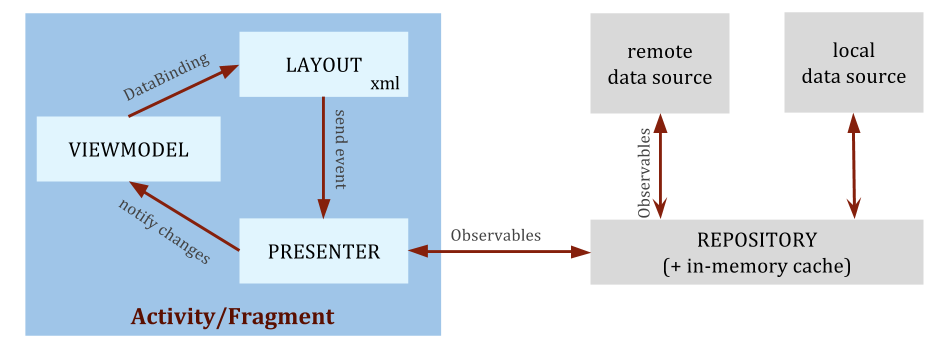
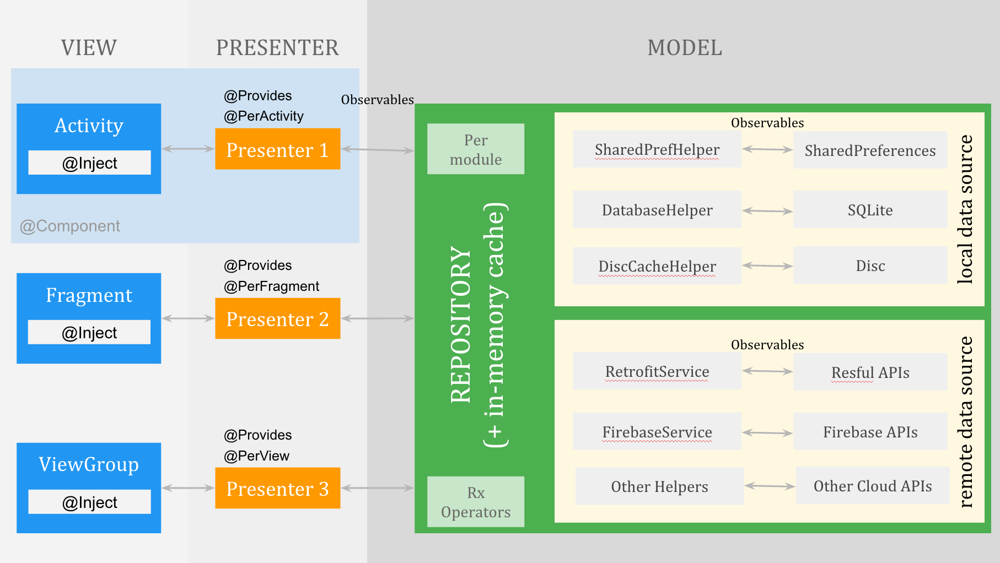

# Architecture guidelines

---- 
# Introduction


The architecture of my projects is mixed of [MVP](https://en.wikipedia.org/wiki/Model%E2%80%93view%E2%80%93presenter) (Model-View-Presenter) and [MVVM](https://en.wikipedia.org/wiki/Model%E2%80%93view%E2%80%93viewmodel) (Model-View-ViewModel) pattern. It is super inspired by [Android Architecture Blueprints](https://github.com/googlesamples/android-architecture) - powered by Google and community. The architecture doesn't follow a strict MVVM or a pattern, as it uses both View Models and Presenters.

With this architecture, it is mixed of the [todo-mvp-databinding](https://github.com/googlesamples/android-architecture/tree/todo-databinding), [todo-mvp-dagger](https://github.com/googlesamples/android-architecture/tree/todo-mvp-dagger), [todo-mvp-rxjava](https://github.com/googlesamples/android-architecture/tree/dev-todo-mvp-rxjava). Consider to see these repositories before continuing to read.


# Key Concepts
## Dagger2


[Dagger2](http://google.github.io/dagger/) is a fully static, compile-time dependency injection framework for both Java and Android. It is an adaptation of an earlier version created by Square and now maintained by Google.

Dependency injection frameworks take charge of object creation. For example, in project we create the TasksPresenter in [TasksActivity](https://github.com/googlesamples/android-architecture/blob/todo-mvp/todoapp/app/src/main/java/com/example/android/architecture/blueprints/todoapp/tasks/TasksActivity.java#L75):

```java
mTasksPresenter = new TasksPresenter(
        Injection.provideTasksRepository(getApplicationContext()), tasksFragment);
```

But in this sample, the presenter is injected. Dagger2 takes care of creation and figuring out the dependencies:

```java
public class TasksActivity extends AppCompatActivity {
    @Inject TasksPresenter mTasksPresenter;
    ...
}
```

## Data Binding


The [Data Binding](https://developer.android.com/topic/libraries/data-binding/index.html) saves on boilerplate code allowing UI elements to be bound to a property in a data model.

  * Layout files are used to bind data to UI elements
  * Events are also bound with an action handler
  * Data can be observed and set up to be updated automatically when 
needed


# Implementation

## Architecture preview

__Architecture Summary__
  


__Architecture Detail Implementation__
  


__Key Concepts__

* __View (UI layer)__: this is where Activities, Fragments, and other standard Android components live. It's responsible for displaying the data received from the presenters to the user (via `View` interface, or notify changes to Android View (e.g. xml layout) via `viewmodel`). It also handles user interactions and inputs (click listeners, etc.) and triggers the right action in the Presenter if needed.

  In this layer, I use the `databinding` framework of Google to bind views, trigger action to `Presenter` and observe data changes from `viewmodel`. Each activity/fragment should be included in a dagger component (i.e. `@Component`). 

* __Presenter__: presenters subscribe to RxJava Observables provided by the `Repository`. They are in charge of handling the subscription lifecycle, analyzing/modifying the data returned by the `Repository` and calling the appropriate methods in the View to display the data.
  
  The __Presenter__ instance is created in `@Module` of each activity/fragment and is provided by using in `@Component`. The `Presenter` should have `@Scope` is appropriate by the activity lifecycle (e.g. `@PerActivity`, `PerFragment`). It subscribes to observables provided by the appropriate `Repository` and process the data in order to call the right method in the `View` or set value to `viewmodel` to notify the view.

* __Model (Data Layer)__: this is responsible for retrieving, saving, caching and massaging data. It can communicate with local databases and other data stores as well as with restful APIs or third party SDKs, cloud APIs. It is divided in two parts: a `data source` and `helpers` part. 
  
  * __Data Source__ 
  
      The `data source` takes care of business logic. It's the heart of this architecture. It is divided in two parts: `local data source` and `remote data source`. `local` will handle all function and logic  related to local data (dics, database (sqlite), `SharedPreferenced`). `remote` part will handle all logic, request and retrieve data from cloud APIs, restful APIs, etc. It keeps a reference to every helper class and uses them to satisfy the requests coming from the presenters. Its methods make extensive use of Rx operators to combine, transform or filter the output coming from the helpers in order to generate the desired output ready for the Presenters. It returns observables that emit data models.
      
      Both are injected into a single `repository` instance that provide methods to request the appropriate data. The `repository` and also `data source` instance is initialized in a common place (i.e. `@Module ApplicationModule`)
    
  * __Helpers__

      A set of classes, each of them with a very specific responsibility. Their function can range from talking to APIs or a database to implementing some specific business logic. The `DataSource` combines and transforms the outputs from different helpers using Rx operators so it can: 
     1. Provide meaningful data to the Presenter,  
     2. Group actions that will always happen together. This layer also contains the actual model classes that define how the data structure is. 
  

Note: in a MVP context, the term "view" is overloaded:

  * The class android.view.View will be referred to as "Android View"
  * The view that receives commands from a presenter in MVP, will be simply called
"view".

## Implementation

## Feature components

There are multiple ways to create the relevant parts of a feature using the Data Binding Library. In this case, the responsibility of each component in this sample is:

  * Activity/Fragment: handles views, interaction with framework components (options menu, Snackbar, FAB, Adapter for list…)
  * Presenter: receives user actions and retrieves the data from the repository. If it doesn't do data loading, it's calling an action handler.
  * ViewModel: Exposes data for a particular view

Some features don't have a ViewMode as they use the model directly.

## Dependencies

  * Common Android support libraries (<code>com.android.support.\*)</code>
  * [Dagger2](http://google.github.io/dagger)
  * [Retrofit2](http://square.github.io/retrofit)
  * [RxJava](https://github.com/ReactiveX/RxJava) and [RxAndroid](https://github.com/ReactiveX/RxAndroid)
  * [The Data Binding Framework](https://developer.android.com/topic/libraries/data-binding/index.html)
  * Android Testing Support Library (Espresso, AndroidJUnitRunner…)
  * Mockito


# Features

## Complexity - understandability

### Use of architectural frameworks/libraries/tools: 

See `Dependencies` part above 

### Conceptual complexity 

Not estimate

### Testability

#### Unit testing

High, presenters are unit tested as well as repositories and data sources.

#### UI testing

High, injection of fake modules allows for testing with fake data

## Code metrics

High class and methods amount

## Maintainability

### Ease of amending or adding a feature

High. 

### Learning cost

  * The Data Binding library takes care of the communication between some components, so developers need to understand what it does and doesn't before making changes to the code.
  * Developers need to be aware of how Dagger2 works, although the setup of new features should look very similar to existing ones.
  * Developers need to have knowledge in `RxJava` and `RxAndroid`.


# References

* [Ribot Android guidelines](https://github.com/ribot/android-guidelines)
* [Android Architecture Blueprints](https://github.com/googlesamples/android-architecture)

